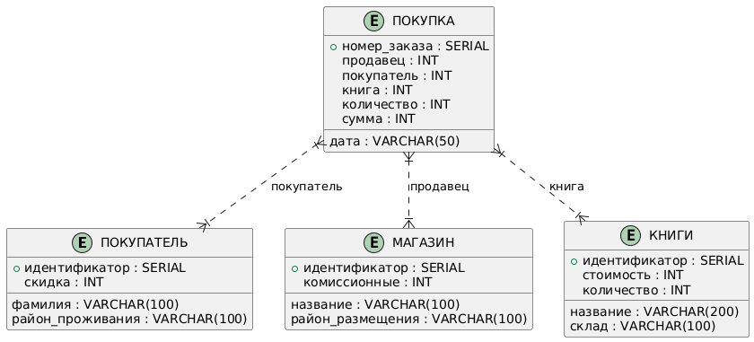

# Отчет по лабораторной работе "База данных книжного магазина"
## Студент: Абрамов Матвей 
## Дата: 08.12.2025

---

## 1. ОПИСАНИЕ СХЕМЫ БАЗЫ ДАННЫХ

### 1.1 Схема БД из формулировки задания

### 3.1 вывод таблицы покупатель

### 3.2 вывод таблицы магазин

### 3.3 вывод таблицы книги

### 3.4 вывод таблицы покупка

### 4.1 Вывод всех различных названий и стоимостей книг

### 4.2 Вывод всех различных районов, в которых проживают покупатели

### 4.3 Вывод всех различных месяцев, когда производились покупки

### 5.1 Фамилии и размер скидки всех покупателей, проживающих в Нижегородском районе

### 5.2 Названия магазинов Сормовского или Советского районов

### 5.3 Названия и стоимость книг, в которых встречается слово "Windows", или которые стоят более 20,000 руб.

### 6.1 Фамилия покупателя и название магазина, где производилась покупка

### 6.2 Дата, фамилия покупателя, скидка, название и количество купленных книг

### 7.1 Номер заказа, фамилия покупателя и дата для покупок на сумму не меньшую чем 60,000 руб

### 7.2 Покупки, сделанные покупателем в своем районе не ранее марта месяца. Вывести фамилию покупателя, район, дату. Произвести сортировку.

### 7.3 Магазины, расположенные в любом районе, кроме Автозаводского, где покупали книги покупатели с скидкой от 10 до 15%

### 7.4 Покупки книг, приобретённые в районе складирования и на складе их больше 10 штук. Вывести номер заказа, название книги, количество

### 8 Модификация всех значений столбца с суммарной величиной покупки, чтобы он содержал истинную сумму, оплачиваемую покупателем (с учетом скидки)

### 9 Расширение таблицы покупок столбцом, содержащим величину комиссионных

### 10.1 Найти покупателей, которые не покупали книг в магазинах Нижегородского района в июне месяце

### 10.2 Найти покупателей, покупавших книги в мае на сумму, меньшую чем купил Потапов в том же месяце.

### 11.1 определить покупателя, имеющего минимальную скидку среди тех, кто покупал книги на сумму не менее 50000руб.

### 11.2 найти покупателя, покупавшего самое большое количество книг

### 11.3 какой из покупателей не покупавший книг в магазинах своего района, делал покупки на минимальную сумму.

### 12 Районы с UNION

### 13.1 какой покупатель покупал все книги в магазине “Наука” или “Знание”;

### 13.2 найти покупателей, покупавших книги во всех магазинах своего района до декабря;

### 13.3 определить покупателей, покупавших все книги, не продающиеся в магазине с максимальным значением комиссионных;

### 13.4 найти среди покупателей тех, кто не покупал с мае книг со ценой более 25000руб. в магазинах с максимальным размером комиссионных.

### 14.1 получить среднюю стоимость покупок, сделанных в магазинах Нижегородского района;

### 14.2 найти количество покупателей, покупавших книги в магазине “Наука”

### 14.3 найти покупателей имеющих скидку ниже средней;

### 14.4 определить магазины, в которых покупало книги больше покупателей чем в магазине “Наука”

### 15.1 вывести данные по суммарной стоимости книг, купленных в каждом магазине

### 15.2 вывести отчет о суммарной стоимости всех купленных книг по районам, где расположены магазины

### 15.3 получить сводную информацию о сумме всех покупок, произведенных каждым покупателем

### 15.4 определить для каждого дня недели количество книг, купленных покупателями не из Советского района

